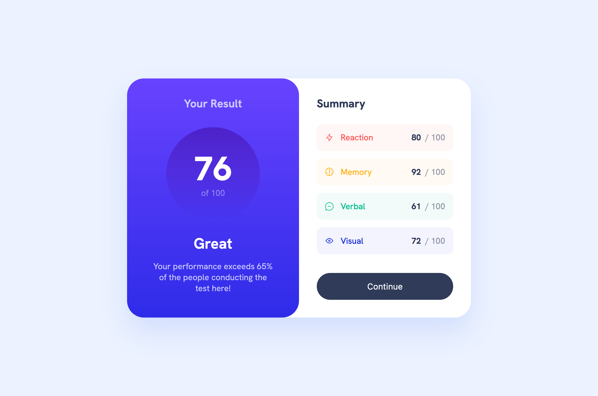
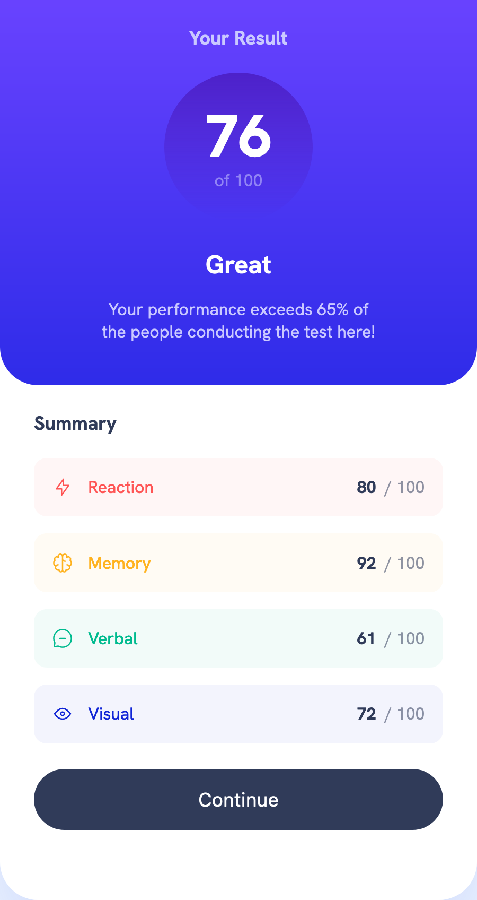

# Frontend Mentor - Results summary component solution

This is a solution to the [Results summary component challenge on Frontend Mentor](https://www.frontendmentor.io/challenges/results-summary-component-CE_K6s0maV). Frontend Mentor challenges help you improve your coding skills by building realistic projects. 

## Table of contents

- [Overview](#overview)
  - [The challenge](#the-challenge)
  - [Screenshot](#screenshot)
  - [Links](#links)
- [My process](#my-process)
  - [Built with](#built-with)
  - [What I learned](#what-i-learned)
  - [Continued development](#continued-development)
  - [Useful resources](#useful-resources)
- [Author](#author)
- [Acknowledgments](#acknowledgments)

## Overview

### The challenge

Users should be able to:

- View the optimal layout for the interface depending on their device's screen size
- See hover and focus states for all interactive elements on the page

### Screenshots

#### Desktop

#### Mobile

### Links

- [Solution on Github]()
- [Live Site on Netlify](https://results-summary-component-joekotvas.netlify.com)

## Notes

### Built with

- Semantic HTML5 markup
- CSS Animation
- Flexbox
- JSON
- Asynchronous Javascript

### Resolving loading issues

I spent a lot of time in this project working out how I wanted the content to respond when the data was taking a while to load. I came up with what I consider to be a slick loading screen and animated transition.

## Author

- Website - [JosephKotvas.com](https://www.josephkotvas.com)
- Frontend Mentor - [@joekotvas](https://www.frontendmentor.io/profile/joekotvas)

## Acknowledgments

Thanks for Scrimba.com for helping me wrap my mind around front end development with JSON data, and to FrontEndMentor.io for the design for this project.